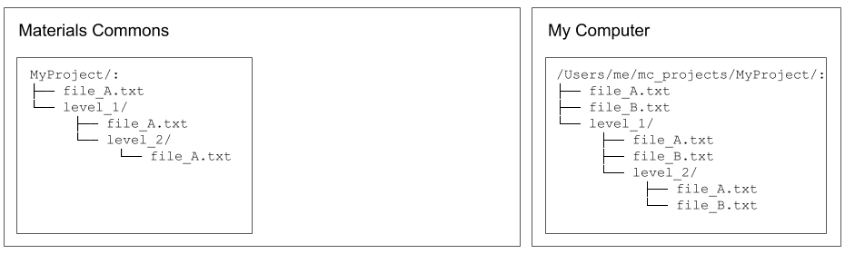
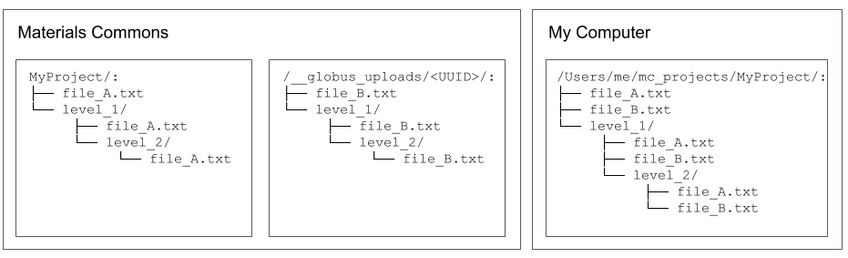
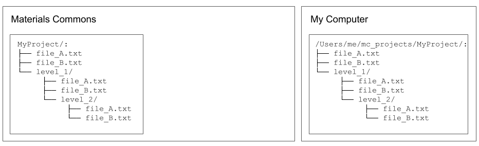

.. manual/up_down_globus.rst

Upload / Download
=================

Standard upload and download
----------------------------

When a local project directory exists (created using ``mc init`` or ``mc clone``), files can be transferred between the local project and the remote project.

File uploading and downloading is performed with the ``mc up`` and ``mc down`` command, respectively. To upload one or more files the basic usage is: ::

    mc up [-r] local_file [local_file ...]

And to download one or more files the basic usage is: ::

    mc down [-r] remote_file [remote_file ...]

The ``-r`` option is used to upload and download directory contents recursively. For ``mc up``, any files given as "path" arguments existing in the local project directory will be uploaded to the corresponding directory in the remote project. Similarly, for ``mc down`` any files given as "path" arguments existing in the remote project directory will be downloaded to the corrsponding directory in the local project. Any intermediate directories that do not exist will be created automatically.

For example, consider a project on Materials Commons named "MyProject" that looks like this: ::

    MyProject/:
    ├── file_A.txt
    ├── file_B.txt
    └── level_1
        ├── file_A.txt
        ├── file_B.txt
        └── level_2
            ├── file_A.txt
            └── file_B.txt

Imagine the local project directory looks like this: ::

    /Users/me/local/mc_projects/MyProject/:
    ├── file_A.txt
    ├── file_C.txt
    └── level_1
        ├── file_A.txt
        └── file_C.txt

If the current working directory is ``/Users/me/local/mc_projects/MyProject/``, then the following are all possible: ::

    # upload one file
    mc up file_C.txt

    # upload two files
    mc up file_C.txt level_1/file_C.txt

    # upload a directory, and its subdirectories, recursively
    mc up -r level_1

    # upload everything in the current directory, and subdirectories, recursively
    mc up -r .

    # download one file
    mc down file_B.txt

    # download two files
    mc down file_B.txt level_1/file_B.txt

    # download a file (creating necessary directory level_1/level_2):
    mc down level_1/level_2/file_A.txt

    # download a directory and subdirectories, recursively:
    mc down -r level_1

    # download all files and subdirectories, recursively:
    mc down -r .

By default, ``mc up``/``mc down`` will check MD5 checksums and not transfer files that already exist. This can be skipped with the ``--no-compare`` option.

There is a limit to the size of files that can be uploaded using the standard file upload process. that depends on the configuration of the particular instance of Materials Commons. The ``mc`` program will skip (with a warning message) uploading any file larger than the size given by the ``--limit`` option (given in MB). The default limit is 50MB.

When uploading a file results in "overwriting" an existing file at the same location, Materials Commons saves the previously existing file as a "version". Access to previous file versions will be enabled in a subsequent release, along with details about how ``mc rm`` and ``mc mv`` effect versions.

Globus installation and configuration
-------------------------------------

The Globus_ transfer service can be used when transferring large files or many files. The Globus client should already be installed as part of the ``materials-commons-cli`` installation process. But, if it is not installed, install with: ::

    pip install globus-sdk
    pip install globus-cli

The following assumes you have a valid Globus_ account.

First, add your Globus account name in the `Account Settings section <https://materialscommons.org/app/accounts/show>`_ on the Materials Commons website. Typically, this is the email address associated with your Globus account.

Second, configure the client side to use Globus. There are two typical cases:

- Case 1) If you are using Globus Personal Connect, for instance on your personal computer, you must have Globus Personal Connect running and log in to Globus: ::

      globus login

- Case 2) If you are using a Globus endpoint managed by someone else, for instance on a shared cluster, ``mc`` must be configured with the Globus endpoint ID. This can be done using the following steps:

  - Find the Globus endpoint ID for the endpoint you will use. Endpoint UUIDs can be found on the `Globus endpoints web interface`_.
  - Configure ``mc`` to use the Globus endpoint ID: ::

      mc config --set-globus-endpoint-id <endpoint_id>

Uploading files with Globus
---------------------------

Globus transfers to Materials Commons take place via a temporary intermediary directory that is created on Materials Commons. The process is as follows:

Step 1, Request a Globus upload directory
^^^^^^^^^^^^^^^^^^^^^^^^^^^^^^^^^^^^^^^^^

Imagine the initial state of your local and remote projects, before uploading, looks like the following:

Imagine that you want to upload the files named "file_B.txt". Request that Materials Commons creates a new Globus upload for the project. This creates a new, empty, upload directory on Materials Commons. It is possible to have multiple upload directories existing at the same time, for the same project, to help manage multiple transfers. Each upload directory requested from ``mc`` is given a name made up of three random words along with an ID and UUID. Access control is set to allow only you to privately access the upload directory via Globus.: ::

    $ mc globus upload --create
    Created Globus upload: 293
        project_name      project_id  type    name                   id  uuid                                  created               status
    --  --------------  ------------  ------  -------------------  ----  ------------------------------------  --------------------  --------
    *   MyProject                589  upload  rivage-popish-bonze   293  c3474f16-b357-4b6c-92ca-fd93a1e37840  2021 Jan  1 03:52:49  Ready

.. image:: ../assets/globus/up.2.png

Step 2, Transfer files
^^^^^^^^^^^^^^^^^^^^^^

At this point, Globus transfers to the upload directory can be initiated with ``mc up`` by adding the ``-g``/``--globus`` option. Multi-file and recursive uploads can be initiated for Globus uploads just as with standard uploads. Since a user can have multiple existing Globus upload directories, the ``mc`` program stores, for each local project, the ID of a "current" Globus upload indicating which upload directory to transfer files to.

If no "current" upload exists when ``mc up`` is called, then ``mc`` will request a new upload directory with a random name and initiate a Globus transfer to it. The newly created upload directory becomes the "current" upload directory and is used when ``mc up -g`` is called subsequently.

The first time a transfer is initiated Globus will generate an authorization token for the ``mc`` program, specific to the computer making the transfer. A browser should be opened automatically taking you to a page with the authorization code which ``mc`` will prompt for. Copy and paste the code into the command line and the transfer should begin. ::

    $ mc up -g file_B.txt
    Using current globus upload (name=rivage-popish-bonze, id=293).
    Please login. If a webpage does not open automatically, go here:

    https://auth.globus.org/v2/oauth2/authorize?... (long link)

    Please enter the code you get after login here: abc123abc123abc123abc123abc123
    Globus task_id: c127a968-57b1-11eb-87bb-02187389bd35
    Globus transfer task initiated.
    Use `globus task list` to monitor task status.
    Use `mc globus upload` to manage Globus uploads.
    Multiple transfer tasks may be initiated.
    When all tasks finish uploading, use `mc globus upload --id 293 --finish` to import all uploaded files into the Materials Commons project.

Any number of Globus transfers can be performed to transfer files into the upload directory. Files will be placed into the upload directory mirroring the project's directory struture, but only directories containing newly uploaded files need to be created.

The command ``globus task list`` can be used to check the status of all initiated transfers. ::

    $ globus task list
    Task ID                              | Status    | Type     | Source Display Name | Dest Display Name          | Label
    ------------------------------------ | --------- | -------- | ------------------- | -------------------------- | --------------------------------
    c127a968-57b1-11eb-87bb-02187389bd35 | SUCCEEDED | TRANSFER | my_MacbookAir       | materials-commons-2-upload | MyProject-rivage-popish-bonze

If a task will not complete (Status != `SUCCEEDED`), check that Globus Personal Connect is running, your internet connection is working, or check and address error messages in the `Globus transfer activity page <https://app.globus.org/activity>`_.

At any point before finishing the upload, you can as a convenience also open the Globus file manager in a web browser with the ``--goto`` command to transfer files using that interface. For example: ::

    $ mc globus upload --id 293 --goto
        project_name      project_id  type    name                   id  uuid                                  created               status
    --  --------------  ------------  ------  -------------------  ----  ------------------------------------  --------------------  --------
        MyProject                589  upload  rivage-popish-bonze   293  c3474f16-b357-4b6c-92ca-fd93a1e37840  2021 Jan 16 03:52:49  Ready

    You want to goto these uploads in a web browser? ('Yes'/'No'): Yes

Step 3, Finish upload
^^^^^^^^^^^^^^^^^^^^^

If all of the "file_B.txt" files are uploaded, the directories will look like the following:

Once all desired transfers are completed, the Materials Commons upload directory can be closed and files processed into your project with the ``--finish`` option for ``mc globus upload``: ::

    mc globus upload --id 293 --finish

The processing time required before files appear in your project will depend on the size of the transfer. The status can be checked with ``mc globus upload``: ::

    $ mc globus upload
        project_name      project_id  type    name                   id  uuid                                  created               status
    --  --------------  ------------  ------  -------------------  ----  ------------------------------------  --------------------  ---------
        MyProject                589  upload  rivage-popish-bonze   293  c3474f16-b357-4b6c-92ca-fd93a1e37840  2021 Jan 16 03:52:49  Finishing

Once processing is finished, the upload directory will no longer appear in ``mc globus upload`` results, and all files should appear in the project directory.

Then, the final state should be:

Additional Notes
^^^^^^^^^^^^^^^^

If you wish to delete an upload directory and not process the files that have already been uploaded, use the ``--delete`` option with ``mc globus upload``.

The current Globus upload directory can be managed with the ``--set`` and ``--unset`` options for ``mc globus upload``.

In the example uploading all the "file_B.txt" files resulted in the remote project matching the local project. This could have also been accomplished by attempting to upload all the local files, recursively: ::

    mc up -g -r .

In this case, ``mc`` will compare the MD5 checksum of the local and remote files and only request that Globus upload the files that are different.

Downloading files with Globus
-----------------------------

The Globus download process is similar to the Globus upload process. The first step is requesting that Materials Commons creates a temporary download directory using ``mc globus download --create``. This will create the temporary download directory and populate it with links to all of the files in the project. Access control is set to allow only you to privately access the download directory via Globus.  ::

    $ mc globus download --create
    Created Globus download: 295
        project_name      project_id  type      name                   id  uuid                                  created               status
    --  --------------  ------------  --------  -------------------  ----  ------------------------------------  --------------------  --------
    *   MyProject                589  download  teerer-armed-gynics   295  db89ab27-92cf-4e12-9b4d-a4c3162f56da  2021 Jan 16 04:52:24  Waiting

The status of the download directory can be checked with ``mc globus download``: ::

    $ mc globus download
        project_name      project_id  type      name                   id  uuid                                  created               status
    --  --------------  ------------  --------  -------------------  ----  ------------------------------------  --------------------  --------
    *   MyProject                589  download  teerer-armed-gynics   295  db89ab27-92cf-4e12-9b4d-a4c3162f56da  2021 Jan 16 04:52:24  Waiting

**Note that it is a known issue that creating the download directory for projects with a very large number of files may be very slow and even fail. An improved download method is under development.**

Once the status is "Ready", downloads can be initiated by adding the the ``-g``/``--globus`` option to ``mc down``. Multi-file and recursive downloads can be initiated for Globus downloads just as with standard downloads. ::

    mc down -g file_B.txt

As with uploads, multiple transfers may be initiated and ``--goto`` may be used to open the Globus file manager for the download directory in a web browser. Once all desired transfers are completed, the Materials Commons download directory can be closed with the ``--delete`` option for ``mc globus download``: ::

    mc globus download --id 295 --delete

The download directory may be left as long as desired, but it will *not* reflect any file or directory changes to the project since the time the download directory was created.

The current Globus download directory can be managed with the ``--set`` and ``--unset`` options for ``mc globus download``.

Reference
---------

For a complete list of options, see:

- `mc up <../reference/mc/up.html>`_
- `mc down <../reference/mc/down.html>`_
- `mc globus <../reference/mc/globus.html>`_

.. _Globus: https://www.globus.org/
.. _`Globus endpoints web interface`: https://app.globus.org/endpoints
